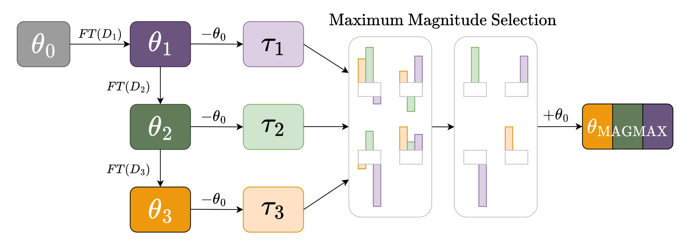

# MagMax: Leveraging Model Merging for Seamless Continual Learning

This is the official repository for the paper:

> **[MagMax: Leveraging Model Merging for Seamless Continual Learning](https://arxiv.org/abs/2407.06322)**<br>
> [Daniel Marczak](https://scholar.google.com/citations?user=Vs4kBzQAAAAJ&hl=en), [Bartłomiej Twardowski](https://scholar.google.com/citations?hl=en&user=8yywECgAAAAJ), [Tomasz Trzciński](https://scholar.google.com/citations?hl=en&user=bJMRBFoAAAAJ), [Sebastian Cygert](https://scholar.google.com/citations?hl=en&user=wLH9PP8AAAAJ)<br>
> ECCV 2024

**TL;DR**: MagMax, which consists of simple sequential fine-tuning and merging with maximum magnitude weight selection, outperforms traditional continual learning methods.

<p align="center">

</p>

> **Abstract:** This paper introduces a continual learning approach named MagMax, which utilizes model merging to enable large pre-trained models to continuously learn from new data without forgetting previously acquired knowledge. Distinct from traditional continual learning methods that aim to reduce forgetting during task training, MagMax combines sequential fine-tuning with a maximum magnitude weight selection for effective knowledge integration across tasks. Our initial contribution is an extensive examination of model merging techniques, revealing that simple approaches like weight averaging and random weight selection surprisingly hold up well in various continual learning contexts. More importantly, we present MagMax, a novel model-merging strategy that enables continual learning of large pre-trained models for successive tasks. Our thorough evaluation demonstrates the superiority of MagMax in various scenarios, including class- and domain-incremental learning settings.


## Installation

For a quick installation use the following commands:
```bash
conda env create
conda activate magmax
```

If it does not work, the env was created by the following commands:
```bash
conda create --name magmax python=3.10
conda activate magmax
conda install pytorch torchvision torchaudio pytorch-cuda=11.8 -c pytorch -c nvidia
pip install wandb tqdm open_clip_torch scipy
```


## Usage

The code is separated into two parts:
* training - these are the scripts `finetune_*`, `ewc*` and `lwf*`
* merging - these are the scripts `merge_*`

### Class-incremental learning (CIL)

For a single run, e.g. sequential fine-tuning (10 epochs) and merging on CIFAR100/20 (seed=5), run the script:
```bash
bash scripts/CIL/finetune_seq.sh ViT-B-16 CIFAR100 10 20 5
```

To reproduce all the CIL results simply run:
```bash
bash scripts/CIL/all.sh
```

### Domain-incremental learning (DIL)

For a single run, e.g. sequential fine-tuning (10 epochs) and merging on ImageNet-R (seed=5), run the script:
```bash
bash scripts/DIL/finetune_seq.sh ViT-B-16 ImageNetR 10 5
```

To reproduce all the DIL results simply run:
```bash
bash scripts/DIL/all.sh
```

### 8 datasets

For a single run, e.g. sequential fine-tuning and merging on 8 datasets (seed=5), run the script:
```bash
bash scripts/8ds/finetune_8ds_seq.sh ViT-B-16 5
```

To reproduce all the 8 datasets results simply run:
```bash
bash scripts/8ds/all.sh
```


### Tips

By default, the code will run on **all available GPUs**. Use `CUDA_VISIBLE_DEVICES=X` to restrict GPU usage.


## Credits

This repo is based on [task_vectors](https://github.com/mlfoundations/task_vectors) and also utilizes some code from [ties-merging](https://github.com/prateeky2806/ties-merging).


## Citation
If you find this work useful, please consider citing it:
```bibtex
@article{marczak2024magmax,
    title   = {MagMax: Leveraging Model Merging for Seamless Continual Learning},
    author  = {Daniel Marczak and Bartłomiej Twardowski and Tomasz Trzciński and Sebastian Cygert},
    booktitle = {European Conference on Computer Vision (ECCV)},
    year    = {2024}
}
```
